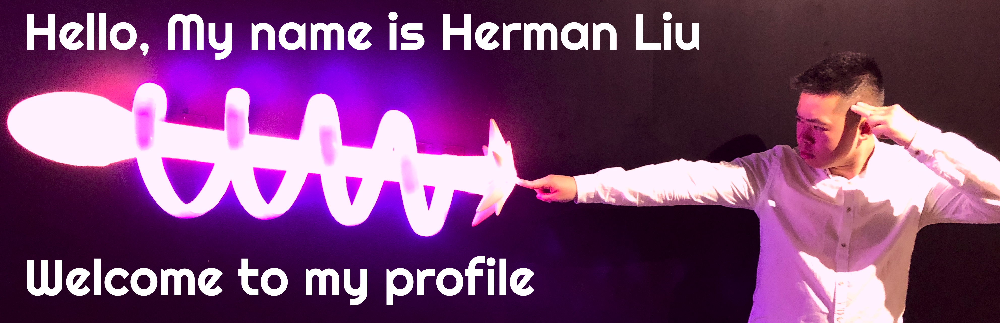

# Hi, I'm Herman 👋😄

## About Me

I'm a full-stack developer focused in front-end development. I love creating web apps with React. I plan on learning many more tehcnologies (TypeScript, GraphQL, Next.js, and many more)! My passion and love for programming started back in 2019 after creating my first website using HTML, CSS, and JavaScript.

- 🔭 I’m currently working on my data structures and algorithms knowledge
- 🌱 I’m currently learning TypeScript and GraphQL
- 👯 I’m looking to collaborate on full-stack || front-end development
- 🤔 I’m looking for help with landing my first tech job 😭
- 💬 Ask me about what I like to do for fun
- 📫 How to reach me: 📧 hermanliu95@gmail.com
- 😄 Pronouns: He/Him
- ⚡ Fun fact: My zodiac sign in 🐷

## My Skills 🚀

## My GitHub Status 👨‍💻

